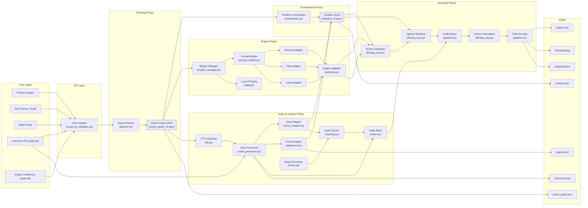
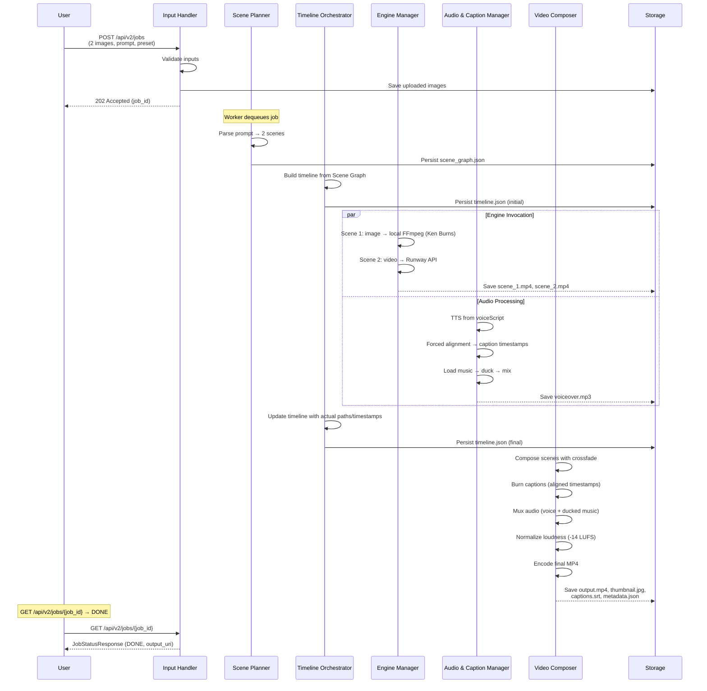

# Pytoon V2 Architecture -- Component Interaction and Data Flow

**Ticket:** P1-07  
**Acceptance Criteria:** V2-AC-021  
**Source:** pytoon-v2.md "Major Components and Their Interactions" (lines 57-69), "Component Interaction Details" (lines 102-106)

---

## 1. Component Architecture Diagram



---

## 2. Data Flow Narrative

### Step 1: Input Ingestion

**Module:** `pytoon/api_orchestrator/routes.py`, `validation.py`  
**Input:** Product images, text prompt, preset selection, optional voiceover, optional engine preference.  
**Output:** Validated `CreateJobRequestV2` → enqueued to Redis.  
**Contract:** V2 request model (Pydantic) with fields for media files, prompt, preset, brand_safe, voiceover, engine preference.

### Step 2: Scene Planning

**Module:** `pytoon/scene_graph/planner.py`  
**Input:** Media file list, prompt, preset_id, brand_safe, target_duration.  
**Output:** `SceneGraph` JSON (conforming to `schemas/scene_graph_v2.json`).  
**Contract:** Scene Graph schema v2.0 -- ordered scenes with media, captions, styles, overlays, transitions, and global audio.

### Step 3: Timeline Construction

**Module:** `pytoon/timeline/orchestrator.py`  
**Input:** `SceneGraph` JSON.  
**Output:** `Timeline` JSON (conforming to `schemas/timeline_v2.json`).  
**Contract:** Timeline schema v2.0 -- timed scene entries, video/audio/caption tracks, transition specs.

### Step 4: Engine Invocation (Parallel)

**Module:** `pytoon/engine_adapters/engine_manager.py`, individual adapters.  
**Input:** `SceneGraph` (scenes requiring video generation).  
**Output:** Per-scene video clips stored at `storage/jobs/{job_id}/scenes/scene_{id}.mp4`.  
**Contract:** `EngineResult` dataclass per scene (video_path, duration_ms, engine_name, success, error_message).

### Step 5: Audio & Caption Processing (Parallel with Step 4)

**Module:** `pytoon/audio_manager/` (tts.py → voice_processor.py → voice_mapper.py → alignment.py, music.py → ducking.py → mixer.py).  
**Input:** `SceneGraph.globalAudio`, optional voiceover file, Timeline.  
**Output:** Processed voiceover file, aligned caption timestamps, ducked music file, mixed audio file.  
**Contract:** Updated `Timeline.tracks.captions[]` and `Timeline.tracks.audio[]` with actual timestamps and file paths.

### Step 6: Video Composition

**Module:** `pytoon/assembler/ffmpeg_ops.py`, `pipeline.py`  
**Input:** Per-scene video clips, Timeline (with transitions, video tracks).  
**Output:** Composed video with transitions (intermediate file).  
**Contract:** Single video file with all scenes concatenated per Timeline timing, transitions applied.

### Step 7: Caption Burn-In

**Module:** `pytoon/assembler/ffmpeg_ops.py`  
**Input:** Composed video, Timeline caption tracks, preset styling.  
**Output:** Video with captions burned in (intermediate file).  
**Contract:** FFmpeg drawtext operations per caption entry with preset-driven styling and safe-zone compliance.

### Step 8: Audio Assembly & Normalization

**Module:** `pytoon/assembler/pipeline.py`, `pytoon/audio_manager/mixer.py`  
**Input:** Composed+captioned video, mixed audio.  
**Output:** Final muxed video with normalized audio.  
**Contract:** MP4 with H.264 video + AAC audio, loudness normalized to -14 LUFS.

### Step 9: Final Export & Persistence

**Module:** `pytoon/assembler/pipeline.py`, `pytoon/worker/runner.py`  
**Input:** Final muxed video, Scene Graph, Timeline, voiceover, caption track.  
**Output:** All artifacts written to `storage/jobs/{job_id}/`.  
**Contract:** V2 output layout (see output-contract-v2.md).

---

## 3. Sequence Diagram -- Sample Video Generation



---

## 4. Data Contract Summary

| Boundary | Producer | Consumer | Contract |
|----------|----------|----------|----------|
| Input → Planner | Input Handler | Scene Planner | `CreateJobRequestV2` (Pydantic) |
| Planner → Orchestrator | Scene Planner | Timeline Orchestrator | `SceneGraph` JSON (scene_graph_v2.json) |
| Orchestrator → Composer | Timeline Orchestrator | Video Composer | `Timeline` JSON (timeline_v2.json) |
| Planner → Engine Manager | Scene Planner | Engine Manager | `SceneGraph.scenes[]` (scenes needing engines) |
| Engine Manager → Composer | Engine Manager | Video Composer | `EngineResult` per scene (video_path, metadata) |
| Planner → Audio Manager | Scene Planner | Audio & Caption Manager | `SceneGraph.globalAudio`, scene captions |
| Audio Manager → Timeline | Audio & Caption Manager | Timeline Orchestrator | Updated `tracks.captions[]`, `tracks.audio[]` |
| Audio Manager → Composer | Audio & Caption Manager | Video Composer | Mixed audio file path |
| Composer → Storage | Video Composer | Storage / API | V2 output artifacts (output.mp4, JSON files, etc.) |

---

## 5. Module Boundaries

```
pytoon/
├── api_orchestrator/     # API layer (Input Handler)
│   ├── routes.py         # V1 + V2 endpoints
│   ├── validation.py     # Input validation
│   └── auth.py           # Authentication
├── scene_graph/          # NEW: Scene Graph (V2)
│   ├── models.py         # Pydantic models
│   ├── planner.py        # Scene Planner
│   └── stub_renderer.py  # Placeholder renderer (Phase 2)
├── timeline/             # NEW: Timeline Authority (V2)
│   ├── models.py         # Pydantic models
│   └── orchestrator.py   # Timeline Orchestrator
├── engine_adapters/      # EXTENDED: + external engine adapters (V2)
│   ├── base.py           # V1 abstract adapter (retained)
│   ├── external_base.py  # NEW: V2 external engine base
│   ├── runway.py         # NEW: Runway adapter
│   ├── pika.py           # NEW: Pika adapter
│   ├── luma.py           # NEW: Luma adapter
│   ├── engine_manager.py # NEW: Multi-engine orchestrator
│   ├── prompt_builder.py # NEW: Prompt construction
│   ├── validator.py      # NEW: Engine response validation
│   ├── local_ffmpeg.py   # V1 (retained)
│   ├── local_comfyui.py  # V1 (retained)
│   ├── api_adapter.py    # V1 (retained)
│   └── selector.py       # V1 (retained for V1 jobs)
├── audio_manager/        # NEW: Audio & Caption Manager (V2)
│   ├── tts.py
│   ├── voice_processor.py
│   ├── voice_mapper.py
│   ├── alignment.py
│   ├── music.py
│   ├── ducking.py
│   └── mixer.py
├── assembler/            # EXTENDED: timeline-driven assembly (V2)
│   ├── ffmpeg_ops.py     # Extended with V2 operations
│   └── pipeline.py       # Extended with V2 pipeline
├── worker/               # EXTENDED: V2 job states and pipeline
│   ├── runner.py         # Extended for V2 jobs
│   ├── state_machine.py  # Extended with V2 states
│   └── ...
├── models.py             # EXTENDED: + V2 models
├── db.py                 # EXTENDED: + SceneRow, V2 columns
├── config.py             # EXTENDED: V2 config loading
├── storage.py            # REUSE
├── queue.py              # REUSE
├── log.py                # REUSE (extend structured fields)
└── metrics.py            # REUSE (extend V2 metrics)
```
